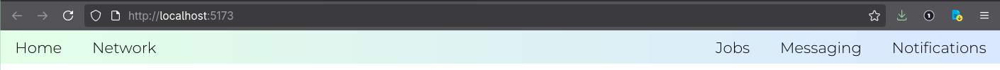

Using the same principle as a with a vertical navbar, there only a few tweaks we are going to apply.

# No flexbox
- `no-flexbox` - Using `inline-bock` on the list items.

# flexbox
- `flexbox` - `ul` wil function as our flexbox container and `li` will be the flexbox items. Additionally add `justify-content: space-evenly` to make a nice even gap between them. We can also go further, and style the links manually with:
    - `padding: 0.5rem 1rem` for space between the l inks
    - `display: block` to expand the clickable area of the links
- `alignt-items: center` - allows us to align the items vertically centered i the flexbox
- `margin-right: auto` - Say we want a logo all the way to the left, and the rest of the menu items all the way to the right, or better yet two items all the way the left and the rest to the right. We can simply select the element we want to start from with `:nth-child(2)` - in this case its the second item, and all `margin-right: auto`, what this does is that it automatically adds margin to the right of this item depending on the view port with. So if the viewport with is all the way wide, it'll compensate the right space of this item with margin.

```css
nav li:nth-child(2) {
    margin-right: auto;
}
```

